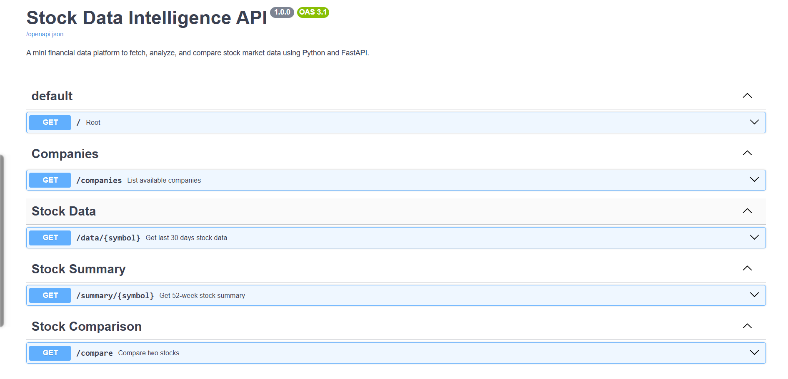
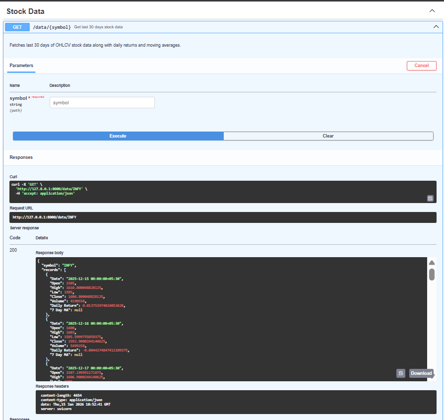
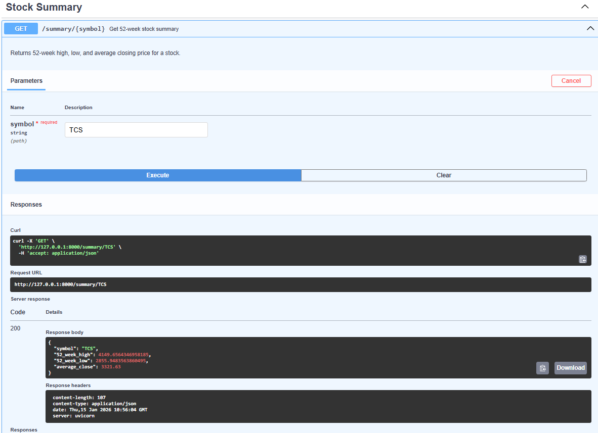
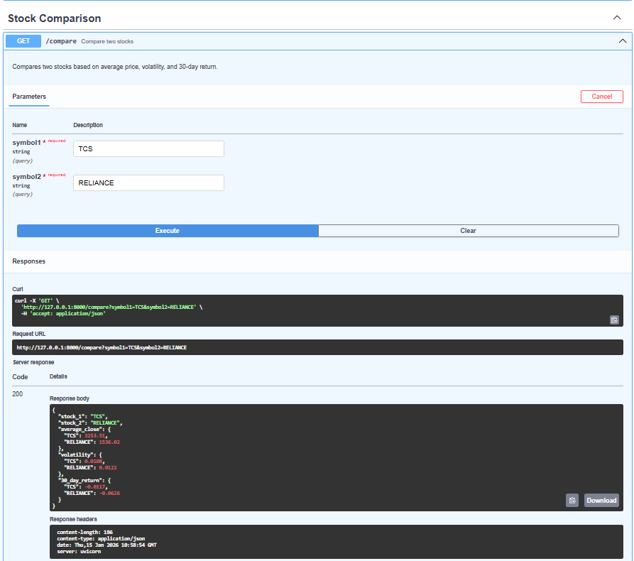
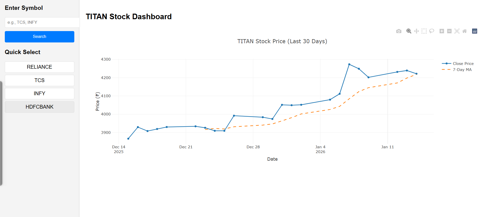

# 📊 Stock Data Intelligence Dashboard
> This project was developed as part of an internship screening assignment to demonstrate backend development, data handling, and API design skills.

## 🔗 Live Demo
**🌐 [View Live Application](https://stock-dashboard-ld6o.onrender.com/)**

A mini financial data platform built using **Python and FastAPI** to fetch, analyze, and visualize stock market data.


---

## 🚀 Features

### ✅ Backend (FastAPI)

* Fetch real stock market data using **Yahoo Finance**
* Clean and process data with **Pandas**
* Calculate financial metrics:

  * Daily Return
  * 7-Day Moving Average
  * 52-Week High / Low
* Expose data via REST APIs
* Auto-generated **Swagger documentation**

### ✅ Bonus Features

* Stock comparison endpoint
* Simple HTML + Plotly dashboard for visualization

---

## 🛠️ Tech Stack

* **Language:** Python 3.10+
* **Backend Framework:** FastAPI
* **Data Processing:** Pandas, NumPy
* **Data Source:** yfinance (Yahoo Finance)
* **Visualization:** Plotly (HTML + JavaScript)
* **API Docs:** Swagger (OpenAPI)

---

## 📁 Project Structure

```
stock-data-dashboard/
│
├── app/
│   ├── main.py        # FastAPI application & endpoints
│   └── data.py        # Stock data fetching & processing
│
├── frontend/
│   └── index.html     # Simple visualization dashboard
│
├── requirements.txt
└── README.md
```

---

## ⚙️ Setup Instructions

### 1️⃣ Clone the repository

```bash
git clone <your-github-repo-url>
cd stock-data-dashboard
```

### 2️⃣ Create virtual environment

```bash
python -m venv venv
```

Activate:

* **Windows**

```bash
venv\Scripts\activate
```

* **Mac/Linux**

```bash
source venv/bin/activate
```

### 3️⃣ Install dependencies

```bash
pip install -r requirements.txt
```

### 4️⃣ Run the backend server

```bash
uvicorn app.main:app --reload
```

Backend will be available at:

```
http://127.0.0.1:8000
```

Swagger UI:

```
http://127.0.0.1:8000/docs
```



---

## 🔌 API Endpoints

### 📌 Get available companies

```
GET /companies
```

### 📌 Get last 30 days stock data

```
GET /data/{symbol}
Example: /data/RELIANCE
```



### 📌 Get stock summary (52-week)

```
GET /summary/{symbol}
Example: /summary/TCS
```



### 📌 Compare two stocks (Bonus)

```
GET /compare?symbol1=RELIANCE&symbol2=TCS
```



---

## 📈 Visualization Dashboard (Bonus)

A simple HTML dashboard is included.

### How to use:

1. Start the backend server
2. Open:

```
frontend/index.html
```

3. Click on any company name
4. View the **closing price chart**



The dashboard fetches live data from the FastAPI backend and plots it using **Plotly**.

---

## 🧠 Design Decisions

* **FastAPI** chosen for clean API design and automatic Swagger docs
* **yfinance** used for reliable public stock data
* **Pandas** for efficient data cleaning and analysis
* Simple frontend to keep focus on backend & data logic
* APIs return clean JSON responses suitable for frontend consumption and external integrations.

---

## 🧪 Future Improvements

* Database integration (PostgreSQL / SQLite)
* Caching for frequent API calls
* Authentication
* Advanced visualizations
* Deployment on cloud platform

---

## 👨‍💻 Author

**Sudhir Patel**
Backend Development | Data Structures | APIs

## License
This project is licensed under the MIT License.
